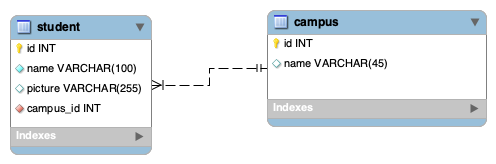

# Support PHP Symfony

## Install & start project
Run commands
```bash
composer install
yarn install
```

Sync DB & load fixtures
```bash
symfony console d:d:c
symfony console d:m:m
symfony console d:f:l
```

Run server
```bash
yarn dev-server
```

```bash
symfony serve
```


## Steps
1. [x] Create entities based on this MPD  
  
2. [x] Create Fixtures (2 campus and 4 students by campus)

TODO  
- [ ] Display sections of campus with students registered on a `/trombinoscope` page
>Hint: make a controller for this route

## Bonus
- [ ] Create a page `/trombinoscope/show` to display information (name & picture) of one student